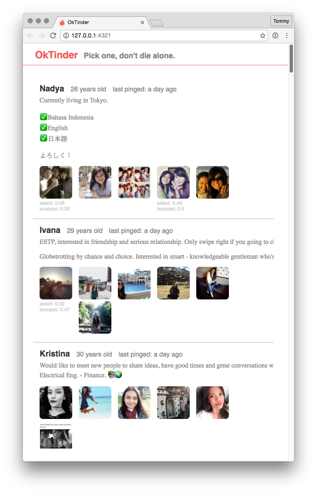

**ToDo**:
- Clean up the state being passed between `item.js` `thumbnail.js` and `lightbox.js`
- Expose chats, superlikes, common friends
- Send messages through a simple textarea
- Use local storage to filter / remove people

